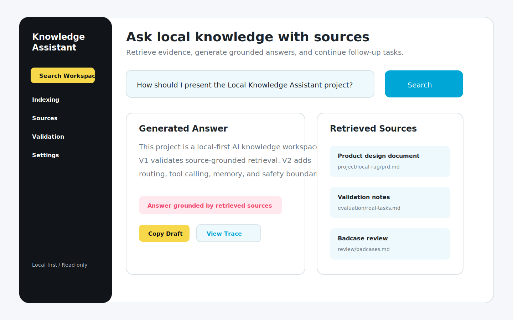
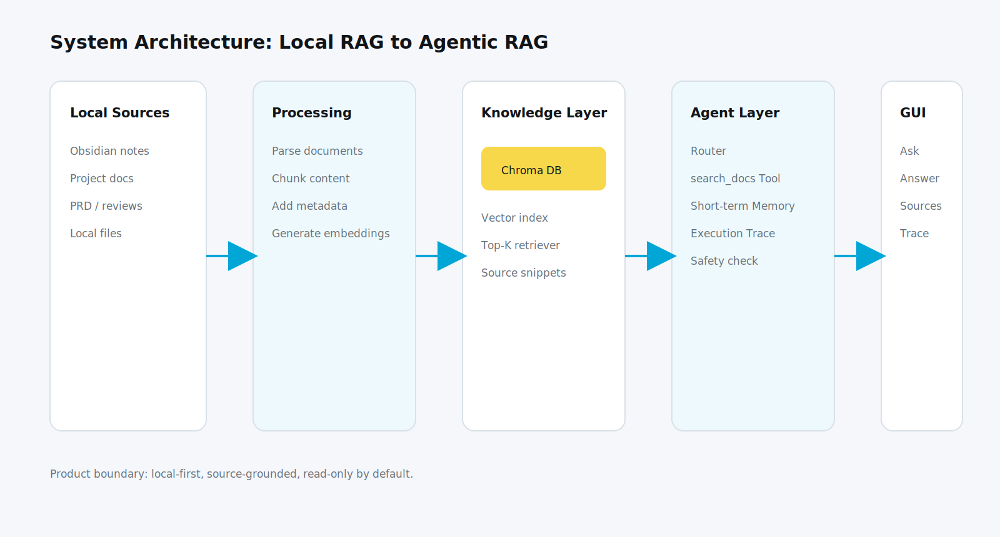
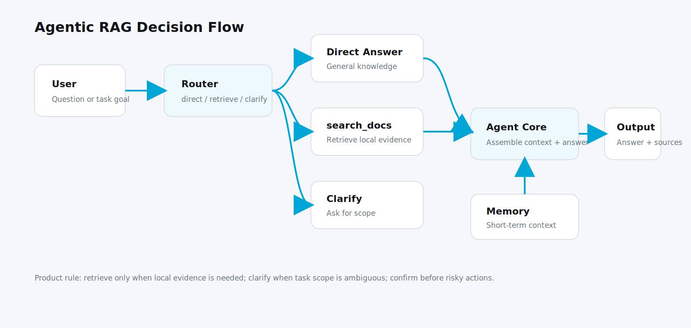
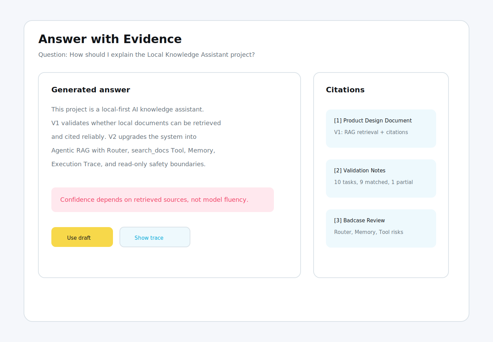
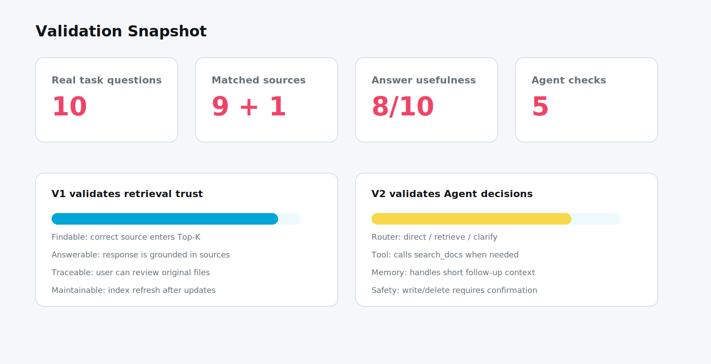

# Local Knowledge Assistant — Product Case Study

## 1. Project Overview

Local Knowledge Assistant is a local-first AI knowledge workspace that evolved from a basic RAG system into an Agentic RAG prototype. The project started from a real knowledge-work problem: historical notes, product documents, project reviews, and portfolio materials were scattered across local folders and Obsidian. Keyword search could find exact terms, but it often failed when the user remembered the meaning rather than the file name.

The product goal was not to build a generic chatbot. The goal was to let a knowledge worker ask natural-language questions, retrieve relevant local sources, receive a grounded answer, and continue follow-up tasks without repeatedly copying context.

The project is positioned as a personal knowledge-workbench MVP, not a mature commercial product. It focuses on product definition, architecture choices, validation, bad case analysis, and controlled automation boundaries.

The product lens is intentionally practical. I treated the system as a workflow product rather than a model showcase: who uses it, what task they are trying to finish, what existing tools fail to cover, what the MVP should not do, and how failures should be turned into iteration rules.

<figure>
  
  <figcaption>Figure 1. Local Knowledge Assistant GUI overview.</figcaption>
</figure>

## 2. Problem & User Scenario

The target users are knowledge workers who repeatedly reuse their own historical materials:

| User type | High-frequency task | Pain point | Product capability |
|---|---|---|---|
| AI product manager / product practitioner | Organize project materials, review project logic, prepare project Q&A | Materials are scattered and hard to connect | Source-grounded retrieval and structured summaries |
| Project manager / consultant | Find evidence from past documents and turn it into reusable methods | Manual search and synthesis are time-consuming | Natural-language search across local documents |
| Research-oriented knowledge worker | Search large note collections, trace sources, and continue reasoning | Keyword search misses semantic intent | RAG retrieval, citations, and short-term follow-up context |

The core task flow is:

Find materials -> verify sources -> summarize -> review -> generate output -> follow up.

This flow defines the product boundary. The system should help users move from raw local documents to evidence-backed answers, but it should not silently rewrite, delete, or overwrite local materials.

The most important scenario is not a one-off question such as "what is RAG?" It is a repeated task where the user remembers a project, a rule, or a conclusion, but does not remember where the evidence lives. In that case, a useful AI product needs to retrieve local context first, expose sources, and then help the user turn the evidence into a usable draft.

## 3. Product Goal

The product goal was defined around four user outcomes:

| Goal | What it means |
|---|---|
| Findable | The user can retrieve relevant local materials even without remembering exact keywords. |
| Trustworthy | Answers are tied to source snippets and file paths so the user can review the original material. |
| Smooth | The user can continue asking follow-up questions without repeating the entire context. |
| Controllable | The system stays local-first and read-only by default, especially before write-back tools are mature. |

The success criteria were intentionally practical: the system should work on real personal tasks, return relevant sources, support answer verification, and expose its limitations when it lacks evidence.

The product should also reduce repeated context input. In traditional LLM usage, the user often has to copy project background, source notes, and desired output format into every new conversation. For this project, the intended workflow is shorter: ask in natural language, retrieve relevant materials, verify the sources, generate a draft, and continue refining with short-term context.

## 4. Solution Architecture

The system was designed in two stages.

V1 used a basic local RAG pipeline:

1. Import local Markdown and document files.
2. Split documents into chunks.
3. Generate embeddings.
4. Store vectors in Chroma.
5. Retrieve top-k chunks for a user query.
6. Generate an answer with citations.
7. Show answer, sources, and paths in a lightweight GUI.

V2 upgraded the fixed RAG pipeline into an Agentic RAG workflow:

1. Router decides whether the user intent should be direct answer, retrieval, clarification, or safety confirmation.
2. `search_docs` wraps RAG retrieval as a callable tool.
3. Memory keeps short-term context for follow-up questions.
4. Agent Core coordinates route decision, tool call, context assembly, and final answer.
5. Execution Trace exposes route decision, tool calls, sources, and final output.

The key product decision was to validate retrieval trust before adding agent behavior. If the RAG layer cannot find reliable sources, an agent layer only adds more visible automation without solving the core trust problem.

I did not choose fine-tuning as the default path. The core problem was not that the model could not write in a stable tone. The core problem was that the model did not know the user's changing local materials and could not reliably cite the source. RAG was therefore the correct V1 architecture, while Agentic RAG became useful only after retrieval could be treated as a dependable tool.

<figure>
  
  <figcaption>Figure 2. System architecture: local documents, processing pipeline, vector store, Agent layer, and GUI.</figcaption>
</figure>

## 5. RAG + Agent Workflow

V1 answered a simple question: can the system find and explain local materials with sources?

V2 answered a different question: can the system choose the right path before answering?

| Scenario | Expected route | Expected behavior |
|---|---|---|
| General concept question | direct | Explain without forcing local retrieval. |
| Local project question | retrieve | Call `search_docs` and cite local sources. |
| Project review task | retrieve | Retrieve multiple sources and produce a structured summary. |
| Follow-up compression | direct or retrieve + memory | Use the previous context without asking the user to repeat it. |
| Ambiguous request | clarify | Ask the user to clarify scope and output purpose. |
| No evidence found | retrieve -> no result | Say that no reliable source was found instead of inventing an answer. |
| Write-back request | confirm | Preview and ask for confirmation before writing. |

This design turns RAG from a fixed pipeline into a tool the assistant can call when local evidence is required.

The workflow also adds a product-level distinction between answer generation and task execution. A direct question can be answered directly. A local evidence question should call retrieval. A vague task should trigger clarification. A write-back request should trigger confirmation. This distinction is the reason the Router is a product module, not just a technical component.

<figure>
  
  <figcaption>Figure 3. Query flow: User -> Router -> Tool(RAG) -> Answer -> Memory.</figcaption>
</figure>

## 6. Core Features

| Feature | Product value |
|---|---|
| Local document ingestion | Allows Obsidian notes and local project documents to become searchable knowledge sources. |
| Semantic retrieval | Covers synonyms, cross-file clues, and natural-language intent better than keyword search. |
| Source-grounded answers | Reduces black-box risk by showing source snippets and file paths. |
| Router | Prevents every question from being forced through the same retrieval pipeline. |
| `search_docs` tool | Makes retrieval available to the agent as a controlled capability. |
| Short-term Memory | Supports follow-up questions while limiting long-term context contamination. |
| Execution Trace | Helps the user understand why the system searched, what it found, and how the answer was produced. |
| Read-only default | Keeps automation inside a safer boundary before write-back tools are mature. |

The core feature set deliberately avoids a large number of tools in the first version. A personal knowledge assistant can quickly become unreliable if every action is automated before retrieval, routing, and safety have been validated. The MVP therefore prioritizes the capabilities that directly support trust: retrieval, citation, route visibility, short-term context, and read-only execution.

<figure>
  
  <figcaption>Figure 4. Source-grounded answer with citations and reviewable evidence.</figcaption>
</figure>

## 7. Validation & Bad Case Analysis

V1 validation focused on retrieval trust:

| Validation focus | Judgment method |
|---|---|
| Findability | Whether the correct source enters Top-K retrieval. |
| Answerability | Whether the answer can be organized based on retrieved sources. |
| Traceability | Whether the user can return to the original file for review. |
| Maintainability | Whether the index can refresh after file updates. |

The current V1 validation used 10 real task questions. 9 were matched, 1 was partially matched, and the answer usefulness was around 8/10 based on manual review.

V2 validation focused on agent control:

| Validation focus | Judgment method |
|---|---|
| Route quality | Whether Router chooses direct / retrieve / clarify correctly. |
| Tool behavior | Whether `search_docs` is called only when local evidence is needed. |
| Memory quality | Whether follow-up questions inherit the right recent context. |
| Traceability | Whether route decision, tool call, sources, and answer are visible. |
| Safety | Whether write/delete actions require confirmation. |

Representative bad cases:

| Bad case | Optimization | Product decision |
|---|---|---|
| Semantically similar but wrong source | Add metadata such as project name, source type, and path; support source filtering. | Similarity is not the same as business relevance. |
| Long-document summary only covered one section | Add section summaries and prioritize outlines for summary tasks. | Basic RAG is good for local QA; long summaries need structure. |
| Router misclassified a local project question as direct | Add local-material signals and clarify on low confidence. | If routing is wrong, the rest of the agent flow is wrong. |
| Tool returned no result but the model tried to answer | Add no-result fallback and uncertainty wording. | No evidence must be treated as a product state, not a prompt failure. |
| Write-back request created risk | Keep read-only default and require preview plus confirmation. | Agent capability boundaries must come before capability expansion. |

The validation method is small-sample and task-based. It is not an online A/B test, and the current result should not be overclaimed as production performance. Its value is that the questions came from real personal knowledge-work tasks and exposed the failure modes that matter for a portfolio-ready AI PM case: retrieval quality, source trust, route correctness, memory behavior, and safety boundaries.

<figure>
  
  <figcaption>Figure 5. Validation snapshot from real task questions.</figcaption>
</figure>

## 8. V1 to V2 Iteration

The upgrade from V1 to V2 was driven by user workflow, not by a desire to add a more complex architecture.

| Dimension | V1: Basic RAG | V2: Agentic RAG |
|---|---|---|
| User input | Single question | Task goal or follow-up request |
| Core capability | Retrieve and answer with citations | Decide route, call tools, use memory, explain process |
| Strength | Source-grounded local QA | Task-aware knowledge workflow |
| Main risk | Retrieval quality and answer grounding | Router errors, Memory contamination, tool failure, safety boundary |
| Validation focus | Correct source in Top-K | Correct decision and controllable execution |

The product judgment is that V2 should not be described as a fully autonomous multi-step agent. At this stage it is a lightweight task-aware assistant that uses routing, retrieval tools, and short-term memory to improve common knowledge-work tasks.

The iteration logic is conservative: V1 proves the knowledge layer; V2 adds control. This sequence matters because an agent that cannot trust its knowledge source will produce confident but hard-to-verify outputs. The better product path is to first make evidence accessible, then make the system smarter about when and how to use that evidence.

## 9. Business Potential

The current project is a personal knowledge-workbench MVP. It should not be packaged as a mature commercial product yet.

However, the direction has clear extension potential:

| Direction | Potential value | Requirement before productization |
|---|---|---|
| Individual knowledge workspace | Help creators, PMs, consultants, and researchers reuse historical materials faster. | More validation tasks, better index refresh, clearer onboarding. |
| Small-team private knowledge assistant | Support project teams with private docs and source-grounded answers. | Permission control, access logs, deployment model, data governance. |
| Multi-tool assistant | Add summarization, comparison, index refresh, and confirmed write-back tools. | Planner, state management, failure recovery, safety confirmation. |
| Portfolio / career knowledge assistant | Turn historical project materials into case studies and structured Q&A. | Output templates, content boundary checks, and source review workflow. |

The most realistic next step is not broad commercialization. It is to make the MVP more stable for repeated personal use, then validate whether small-team scenarios show similar pain and willingness to adopt.

Commercialization would require a different level of evidence and infrastructure: permission management, team knowledge governance, deployment options, audit logs, data update workflows, and a clearer buying scenario. Those are not solved in the current MVP. The current value is to demonstrate a credible product direction and the judgment required to avoid presenting an early prototype as a mature platform.

## 10. My Role & Product Decisions

My role was not simply to build a technical demo. I handled the product work needed to turn the AI capability into a usable MVP:

- Defined target users, high-frequency scenarios, and non-goals.
- Compared ChatGPT, Notion AI, Obsidian search, RAG, Agentic RAG, and fine-tuning.
- Scoped V1 around retrieval trust before adding agent behavior.
- Designed the V2 modules: Router, `search_docs` Tool, Memory, Agent Core, Execution Trace, and Safety boundary.
- Built validation questions around real tasks rather than synthetic examples.
- Converted bad cases into product and architecture decisions.
- Kept the current system local-first and read-only by default.

Key product decisions:

| Decision | Reason | Trade-off |
|---|---|---|
| Start with RAG before Agent | Retrieval trust is the foundation of the product. | V1 is less flexible and cannot route tasks. |
| Wrap RAG as `search_docs` | Retrieval becomes a reusable agent capability. | Tool input, output, and failure states must be designed. |
| Use short-term Memory only | Supports follow-up tasks while reducing contamination. | No long-term personalization yet. |
| Keep Agent read-only by default | Prevents accidental writes and local knowledge pollution. | Lower automation level. |
| Do not prioritize fine-tuning now | The core problem is knowledge access, updates, and source tracing, not style training. | Router and output format stability may need later improvement. |

This case demonstrates product judgment around AI systems: automation is not always better. The useful boundary is the point where efficiency improves while trust, traceability, and user control remain intact.
