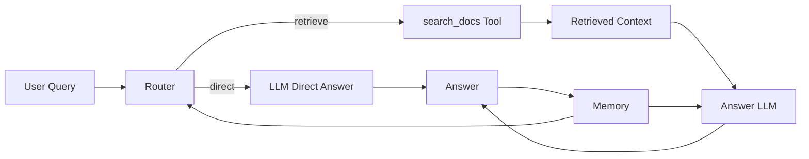

# 产品设计文档：本地知识助手（从 RAG 到 Agentic RAG 的演进实践）

## 目录

- [[#1. 项目概述（TL;DR）|1. 项目概述（TL;DR）]]
- [[#2. 问题定义 & 用户需求|2. 问题定义 & 用户需求]]
- [[#3. V1：基础 RAG 系统设计|3. V1：基础 RAG 系统设计]]
- [[#4. V2：Agentic RAG 系统设计（决策驱动升级）|4. V2：Agentic RAG 系统设计（决策驱动升级）]]
- [[#5. V1 vs V2 对比|5. V1 vs V2 对比]]
- [[#6. 关键设计思考|6. 关键设计思考]]
- [[#7. 效果评估|7. 效果评估]]
- [[#8. 未来扩展|8. 未来扩展]]
- [[#9. 我的角色（AI PM）|9. 我的角色（AI PM）]]

## 1. 项目概述（TL;DR）

### 1.1 一句话总结

本项目是一个面向个人知识管理场景的本地知识助手，从 V1 的基础 RAG 检索问答，演进到 V2 的 Agentic RAG，通过 Router、Tool、Memory 和 Agent Core，让系统从“被动检索回答”升级为“能判断、能调用工具、能保留上下文的知识助手”。

不仅完成了从 RAG 到 Agent 的演进，也验证了这套方案在个人知识管理、项目复盘和资料整理场景中的实际使用价值。

当前项目定位仍是个人知识工作台 MVP，不包装成已商业化产品；但在产品设计上保留了向小团队私有知识助手延展的路径思考。

### 1.2 三点总结（问题 / V1 / V2）

| 维度 | 内容 |
|---|---|
| 问题 | 个人笔记、项目资料和工作沉淀分散在 Obsidian 与本地文件中，关键词搜索难以找回语义相近内容，直接问 LLM 又缺少来源依据和隐私保障。 |
| V1 | 建立本地知识助手：文档导入、chunk 切分、本地 embedding、Chroma 向量检索、基于上下文回答、来源引用和 Web GUI。 |
| V2 | 在 RAG 之上加入 Agent 控制层：Router 判断是否检索，RAG 被封装为 search_docs Tool，Memory 保存最近上下文，Agent Core 负责任务调度和结果生成。 |

> [!summary] 项目定位
> 这不是两个割裂的 demo，而是同一个知识助手产品的两阶段演进：先解决“资料找得回、答案有依据”，再解决“系统会判断、会调用工具、能支持连续任务”。

## 2. 问题定义 & 用户需求

### 2.1 用户场景

核心用户是有大量本地知识资产的个人知识工作者，典型场景包括：

| 场景 | 真实问题 | 用户期望 |
|---|---|---|
| 项目展示 | 准备项目展示或阶段复盘时，需要从大量项目文档、分析记录和验证结果中找回可引用材料。 | 输入一个问题后，系统能找回相关项目资料，并给出有来源的回答。 |
| 项目复盘 | 一个项目的背景、需求、方案、验证结果分散在多个 Markdown 和本地文档里。 | 能跨文件召回相关片段，快速拼出项目全貌。 |
| 知识检索 | 用户记得“大概写过某个观点”，但不记得关键词、文件名或目录位置。 | 用自然语言搜索，而不是依赖精确关键词。 |
| 隐私资料管理 | 私人笔记、项目复盘和本地资料不适合上传到云端知识库。 | embedding、向量库、缓存和回答过程尽量留在本地。 |
| 连续追问 | 用户不是只问一次，而是会基于上一轮结果继续追问、对比或总结。 | 系统需要理解最近上下文，而不是每次都当作孤立问题处理。 |

### 2.2 核心问题

一句话抽象：

用户真正需要的不是一个“会聊天的模型”，而是一个能在本地资料中找回依据、判断是否需要检索、并支持连续追问的可信知识助手。

这个问题可以拆成三层：

| 层级 | 具体表现 | 产品挑战 |
|---|---|---|
| 找得到 | 文件多、目录多、关键词不确定。 | 需要语义检索，而不是只靠文件名和关键词。 |
| 信得过 | LLM 可以生成流畅答案，但可能没有依据。 | 回答必须绑定来源片段，方便用户复核。 |
| 用得顺 | 用户会连续追问，也会提出不同类型任务。 | 系统需要具备路由、上下文和工具调用能力。 |

### 2.3 产品目标

| 目标 | 说明 |
|---|---|
| 本地可控 | 资料、embedding、向量库、缓存和日志尽量保留在本机。 |
| 来源可信 | 回答必须绑定来源片段，方便用户回到原文复核。 |
| 日常可用 | 提供 Web GUI，降低命令行门槛。 |
| 可持续演进 | V1 先完成基础 RAG，V2 再加入 Agent 控制层。 |
| 可产品化延展 | 当前先服务个人场景，后续可探索小团队本地知识助手，但不在本阶段追求完整商业化。 |

### 2.4 技术选型（为什么选择 RAG）

为什么不是 fine-tune：

| 维度 | Fine-tune 的问题 | RAG 的优势 |
|---|---|---|
| 知识更新 | 私人笔记和项目资料经常变化，微调成本高。 | 新增文档后重新索引即可更新知识。 |
| 来源追溯 | 微调后的模型很难说明答案来自哪个文件。 | RAG 可以展示来源文件、标题和片段。 |
| 隐私控制 | 微调通常需要上传训练数据或维护更复杂训练环境。 | 本地知识助手 可以把资料、embedding 和向量库留在本机。 |
| 项目阶段 | 当前目标是作品集 Demo 和个人使用工具，不需要训练新模型。 | RAG 更适合快速验证产品闭环。 |

为什么不是纯 LLM：

| 维度 | 纯 LLM 的问题 | RAG 的解决方式 |
|---|---|---|
| 私有知识 | 模型不知道用户本地资料。 | 通过检索把相关资料提供给模型。 |
| 幻觉风险 | 模型可能编造不存在的项目细节。 | 回答要求基于召回片段，并附引用。 |
| 可复核性 | 用户难以判断答案是否真实。 | 用户可以回到原文检查依据。 |
| 长期维护 | 资料变化后模型本身不会自动更新。 | 重建或增量更新索引即可。 |

产品决策：

先用 RAG 建立“可信知识检索层”，再在 RAG 之上加入 Agent 控制层。这样既保留来源可追溯，又能逐步增强系统的决策和任务执行能力。

## 3. V1：基础 RAG 系统设计

### 3.1 架构设计

V1 的系统目标是跑通一个本地知识库 RAG 闭环：


架构分层：

| 层级 | 作用 | 设计重点 |
|---|---|---|
| 数据源层 | Obsidian Markdown、本地文档、脱敏测试文档。 | 原始文件只读，不直接修改。 |
| 文档处理层 | 文档转换、清洗、切分。 | 保留标题、路径、来源类型等元数据。 |
| 向量层 | 本地 embedding + Chroma。 | 语义召回、本地持久化、可迁移。 |
| 检索层 | query embedding + 相似度搜索。 | 返回相关片段，而不是直接给结论。 |
| 生成层 | 将召回片段放入 prompt，让 LLM 生成回答。 | 要求基于上下文，不编造。 |
| 体验层 | FastAPI + Web GUI。 | 降低命令行门槛，让项目像产品而不是脚本。 |

### 3.2 核心流程（Retrieve → Generate）

V1 的核心链路是“先检索，再回答”：

1. 用户在 GUI 中输入自然语言问题。
2. 系统将问题转成 query embedding。
3. Chroma 根据向量相似度召回相关 chunks。
4. GUI 展示候选片段、来源文件、标题和片段内容。
5. 如果用户需要问答，系统把召回片段组装进 prompt。
6. LLM 基于上下文生成回答。
7. 回答区展示结果和引用来源。
8. 用户根据来源回到原文复核。

这个流程的产品原则是：

> 先让用户看到依据，再让模型组织答案。

### 3.3 关键模块设计

#### 3.3.1 文档处理

chunk 切分不是简单按字数硬切，而是要兼顾“可检索”和“可理解”：

| 设计点 | 说明 |
|---|---|
| 保留结构 | 尽量保留标题、章节和文件路径，便于回到原文。 |
| 合并短章节 | 对标题很多但正文很短的文档，合并短章节，避免碎片过多。 |
| 控制 chunk 大小 | chunk 太小会丢失上下文，太大又会影响召回准确性和 prompt 成本。 |
| 保留元数据 | 每个 chunk 记录 source_type、path、title、heading、chunk_id。 |

#### 3.3.2 向量检索

V1 采用轻量语义检索策略：

| 策略 | 说明 |
|---|---|
| 本地向量库 | 使用 Chroma 持久化保存 embedding 和元数据。 |
| top_k 召回 | 根据用户问题召回若干个最相关片段。 |
| 来源筛选 | GUI 支持按资料源筛选，例如 Obsidian 或本地文档。 |
| 路径刷新 | 文件重新索引时，先清理同一路径旧 chunks，再写入新 chunks。 |

#### 3.3.3 Prompt设计

V1 的 prompt 重点不是“让模型发挥”，而是限制模型只基于来源回答：

| Prompt 原则 | 产品目的 |
|---|---|
| 优先使用上下文 | 降低脱离资料自由发挥。 |
| 上下文不足时说明不确定 | 避免伪造项目细节。 |
| 回答简洁清晰 | 符合知识检索场景，不做过度创作。 |
| 输出引用来源 | 让用户能复核答案。 |

### 3.4 系统能力

V1 已经验证的效果：

| 指标 | 当前结果 |
|---|---|
| 已索引文件 | 163 个文件 |
| 向量片段 | 390 个 chunks |
| 运行方式 | 本地运行，Ollama embedding + Chroma + FastAPI GUI |
| 典型命中 | 文件管理规则、RAG 使用手册、项目资料和产品说明等问题可以召回对应来源 |

用户体验变化：

- 从“翻目录找文件”变为“自然语言找资料”。
- 从“直接问模型但不知道依据”变为“先看来源，再看回答”。
- 从“命令行工具”变为“可日常打开的 Web GUI”。

### 3.5 存在问题（必须为V2铺垫）

V1 虽然完成了 RAG 闭环，但它仍然是一个相对静态的系统。

| V1 问题 | 表现 | 产品洞察 |
|---|---|---|
| 所有问题强制检索 | 无论用户问的是闲聊、解释概念、还是需要查资料的问题，系统都默认走检索。 | RAG 缺少“是否需要检索”的判断能力，导致流程不够智能。 |
| 无决策能力 | 系统只能被动接收问题并召回片段，不能判断任务类型。 | 用户真实需求往往是“整理项目”“生成报告”“对比资料”，不是单一问答。 |
| 无多轮记忆 | 每轮问题相对独立，无法自然继承上一轮上下文。 | 知识助手需要支持连续追问，否则用户每次都要重复背景。 |
| 工具边界不清 | 检索只是代码流程的一部分，没有被抽象成可被调用的工具。 | 如果后续要扩展为多工具系统，必须先把 RAG 能力工具化。 |
| 过程不可解释 | 用户看到结果，但不一定知道系统做了哪些步骤。 | 面向 Agent 的产品需要展示决策、工具调用和来源，降低黑盒感。 |

V1 的核心结论：

> 基础 RAG 解决了“知识可检索、回答可追溯”，但还没有解决“系统会不会判断、会不会调用工具、能不能连续完成任务”。

## 4. V2：Agentic RAG 系统设计（决策驱动升级）

Agentic RAG 的核心思想：

不再把 RAG 当作固定流程，而是在 RAG 上增加一层 agent 控制层，让系统具备“决策 + 工具调用 + 记忆”的能力。

也就是说，V2 的重点不是把检索做得更复杂，而是让 LLM 从“被动生成答案的组件”升级为“负责路径选择与工具调度的决策中枢”。

Agent 的引入，本质上是把系统从“信息检索工具”升级为“任务执行入口”。



### 4.1 升级动机（承接V1问题）

V1 已经完成“检索增强生成”的基础闭环，但仍存在强制检索、缺少决策、缺少记忆和工具边界不清的问题。因此 V2 的升级目标是：

从产品本质上看，这次升级不是简单地在原有 RAG 上叠加几个模块，而是把系统从“用户提问，系统回答”的问答系统，升级为“用户提出任务目标，系统判断路径并调用工具完成任务”的任务驱动系统。

| 目标 | 说明 |
|---|---|
| 从固定流程到动态决策 | 不再每个问题都默认检索，而是先判断是否需要查知识库。 |
| 从函数调用到工具调用 | 将 RAG 检索封装成 search_docs Tool，为后续多工具扩展打基础。 |
| 从单轮问答到上下文连续 | 加入 Memory，保存最近对话，让连续追问更自然。 |
| 从黑盒结果到过程可解释 | 展示 route decision、tool call、tool output 和最终回答。 |
| 从检索系统到知识助手 | 用户输入的不只是问题，也可以是“帮我整理项目”“对比两个项目”这类目标。 |

### 4.2 Agent 架构总览

V2 在 V1 的 RAG 能力之上新增 Agent 控制层，包含四个核心模块：

| 模块 | 产品职责 | 技术职责 |
|---|---|---|
| Router | 判断用户问题是否需要检索，识别问题类型。 | 用 LLM 或规则 prompt 输出结构化 route decision。 |
| Tool | 将知识库检索能力封装成标准工具。 | search_docs(query) 调用向量检索并返回相关文本。 |
| Memory | 保存最近对话，支持上下文继承。 | 保留最近 3 轮对话或任务摘要。 |
| Agent Core | 调度 Router、Tool、Memory 和 Answer 生成。 | 控制主流程：决策、调用工具、组装上下文、生成答案、更新记忆。 |

升级后的架构分层：

| 层级 | V1 | V2 |
|---|---|---|
| 数据层 | 文档、chunks、metadata | 不变 |
| 检索层 | query -> vector search | 被封装为 search_docs Tool |
| 生成层 | 基于检索片段回答 | 根据 Router 决策选择 direct 或 retrieve |
| 控制层 | 无独立控制层 | 新增 Agent Core |
| 上下文层 | 单轮上下文 | 新增 Memory |
| 体验层 | 展示搜索和问答结果 | 展示执行过程、工具调用和下一步建议 |

### 4.3 核心模块设计

#### 4.3.1 Router（决策层）

Router 的产品职责是回答一个关键问题：

> 当前用户问题，是否需要查询知识库？

Router 的判断逻辑：

| 用户问题类型 | Route | 例子 |
|---|---|---|
| 涉及本地文档、项目资料、历史记录 | retrieve | “本地知识助手 Agentic RAG 项目如何介绍？” |
| 需要总结、对比、复盘，但依赖已有资料 | retrieve | “对比本地知识助手 和企业知识库 RAG 的区别。” |
| 普通知识解释或轻量闲聊 | direct | “什么是 RAG？” |
| 问题过于模糊 | retrieve 或追问 | “帮我整理一下项目。” |

Router 的价值：

- 避免所有问题都强制检索。
- 让系统能区分“普通回答”和“基于知识库回答”。
- 为后续复杂任务分类、Planner 和多工具调度打基础。

#### 4.3.2 Tool（工具调用）

Tool 的核心设计是把 RAG 检索从“内部流程”抽象成“Agent 可调用能力”。

工具定义：

```text
search_docs(query) -> related_context
```

产品含义：

| 设计点 | 说明 |
|---|---|
| 工具名明确 | search_docs 表示“查本地知识库”，用户和评审者都容易理解。 |
| 输入清晰 | 输入是自然语言 query 或 Agent 拆解后的子问题。 |
| 输出可复核 | 输出包含片段、来源、标题、路径、source_type。 |
| 边界明确 | 当前 Tool 只读，不自动写入、删除或修改本地文件。 |

Tool 抽象的关键价值：

一旦 RAG 被封装为 Tool，后续就可以继续扩展其他工具，例如：

- summarize_doc
- compare_projects
- write_to_obsidian
- update_index
- web_search

这会让系统从“一个 RAG 应用”演进为“多工具 Agent 工作台”。

该设计也为未来接入 API、数据库和自动化工具提供统一调用接口。

#### 4.3.3 Memory（记忆层）

Memory 的产品职责是让系统理解最近对话，而不是每次都从零开始。

当前设计：

| 设计项 | 说明 |
|---|---|
| 保存范围 | 最近 3 轮对话或最近任务上下文。 |
| 保存内容 | 用户问题、Agent 决策、最终回答摘要。 |
| 使用方式 | Router 判断和 Answer 生成时都可以参考 Memory。 |
| 边界 | 不把 Memory 当成长期知识库，长期知识仍通过 RAG 索引管理。 |

为什么 Memory 必须存在：

- 用户会追问“这个结论依据是什么？”。
- 用户会说“继续刚才那个项目”。
- 用户会要求“把上面内容压缩成摘要版本”。

如果没有 Memory，系统无法自然理解“刚才”“这个项目”“上面内容”等指代。

#### 4.3.4 Agent Core（调度/控制）

Agent Core 是 V2 的调度中枢，负责把 Router、Tool、Memory 和 Answer 组合成完整链路。

主流程：

1. 接收用户 query。
2. 读取最近 Memory。
3. Router 判断 action：retrieve 或 direct。
4. 如果 direct，直接调用 LLM 生成回答。
5. 如果 retrieve，调用 search_docs Tool。
6. 将检索结果、用户问题、Memory 组装成 answer prompt。
7. LLM 生成最终回答。
8. 保存本轮对话到 Memory。
9. 返回最终答案、执行步骤和引用来源。

V2 的产品原则：

> Agent 可以调度工具完成任务，但必须在“可控范围内执行”，所有涉及外部写入或状态改变的操作都需要显式确认。

### 4.4 核心流程（Decision → Tool → Reasoning → Output）

V2 的核心链路从固定的 Retrieve → Generate，升级为 Decision → Tool → Reasoning → Output：

1. 用户输入自然语言问题或任务目标。
2. Agent Core 读取最近 Memory。
3. Router 判断当前问题是否需要检索。
4. 如果不需要检索，进入 direct answer。
5. 如果需要检索，调用 search_docs Tool。
6. Tool 返回相关片段、来源、标题、路径和 source_type。
7. Agent Core 将问题、Memory 和检索结果组装成 answer prompt。
8. LLM 基于上下文进行 reasoning 和 generation。
9. 系统返回答案、引用来源、执行步骤和下一步建议。
10. Memory 保存本轮对话摘要，支持后续追问。

### 4.5 系统能力升级

V2 的价值不是让系统显得更复杂，而是让用户在真实任务里感受到“更顺手、更可信、更像助手”的体验变化：

| 价值 | 说明 |
|---|---|
| 更符合用户意图 | 用户有时需要查资料，有时只是需要解释、改写或总结；Router 让流程更贴合意图。 |
| 更可解释 | 用户能看到系统是否检索、调用了什么工具、基于哪些来源回答。 |
| 更可扩展 | RAG 工具化后，可以继续接入写作、对比、索引更新等工具。 |
| 更适合产品展示 | 能清楚说明从 RAG 到 Agentic RAG 的演进逻辑，而不是堆功能。 |
| 更安全 | Agent 默认只读，不自动改文件，避免“能执行但不可控”的风险。 |

从用户视角看，这次升级最大的变化不是系统更复杂，而是系统更像一个会判断的助手，而不是只会查资料的工具。

## 5. V1 vs V2 对比

### 5.1 架构对比

| 维度 | V1：基础 RAG | V2：Agentic RAG |
|---|---|---|
| 产品定位 | 本地知识检索与来源问答系统 | 具备决策、工具调用和上下文能力的本地知识助手 |
| 用户输入 | 一个问题 | 一个问题或一个任务目标 |
| 主流程 | query -> retrieve -> answer | query -> route -> tool/direct -> answer -> memory |
| 是否每次检索 | 默认检索 | Router 判断是否需要检索 |
| RAG 角色 | 固定流程中的检索模块 | 被封装为 search_docs Tool |
| 控制层 | 无独立控制层 | Agent Core 负责调度 |
| 记忆层 | 无独立记忆层 | Memory 保存最近对话 |

### 5.2 能力对比

| 维度 | V1：基础 RAG | V2：Agentic RAG |
|---|---|---|
| 上下文能力 | 单轮问答为主 | 保存最近对话，支持连续追问 |
| 可解释性 | 展示来源和答案 | 展示 route decision、tool call、引用和下一步建议 |
| 扩展性 | 主要扩展检索和 GUI | 可扩展多工具、Planner、多 Agent |
| 风险控制 | 资料本地化、引用复核 | 增加只读工具边界和人工确认机制 |

### 5.3 用户体验对比

| 维度 | V1：基础 RAG | V2：Agentic RAG |
|---|---|---|
| 提问方式 | 更像搜索或问答。 | 可以输入任务目标，例如“帮我整理这个项目的展示材料”。 |
| 过程理解 | 用户看到来源和答案。 | 用户还能看到决策、工具调用和下一步建议。 |
| 连续追问 | 需要重复背景。 | 可继承最近上下文，减少重复输入。 |
| 信任感 | 通过引用来源建立信任。 | 通过执行过程 + 引用来源建立信任。 |

## 6. 关键设计思考

### 6.1 为什么RAG需要决策层

基础 RAG 的默认假设是：用户每次提问都需要检索。

但真实使用中并不是这样：

- 有些问题需要查本地资料。
- 有些问题只需要解释概念。
- 有些问题需要基于上一轮内容继续总结。
- 有些问题应该先追问澄清，而不是直接检索。

Router 的价值是让系统从“固定工作流”变成“动态决策流”。

产品角度看，Router 解决的是意图识别问题；技术角度看，Router 是 Agent 控制层的入口。

### 6.2 为什么要引入Tool抽象

如果 RAG 只是代码里写死的一段检索逻辑，它只能服务当前问答流程。

但如果把 RAG 封装成 Tool，它就可以被 Agent 调用、组合和扩展。

Tool 抽象的本质是：

> 把能力产品化，把流程模块化。

这一步决定了系统能不能从“单一 RAG 应用”升级为“多工具 Agent 平台”。

### 6.3 Memory在Agent中的作用

没有 Memory 的系统只会处理孤立问题。

但真实用户的表达往往依赖上下文：

- “这个项目怎么讲？”
- “帮我压缩成摘要。”
- “如果需要对外展示，哪些内容需要脱敏？”
- “那和另一个项目有什么区别？”

Memory 让系统能理解“这个”“刚才”“上面”的指代，也让用户不需要反复输入背景。

产品上，Memory 不是为了炫技，而是为了降低用户重复表达成本。

### 6.4 RAG vs Agent的本质区别

| 维度 | RAG | Agent |
|---|---|---|
| 核心能力 | 检索增强生成 | 决策、规划、工具调用、记忆 |
| 系统角色 | 回答生成链路中的知识补充层 | 任务执行链路中的调度中枢 |
| 典型问题 | “基于资料回答这个问题” | “判断要不要查资料，并决定如何完成任务” |
| 关键模块 | retriever、context、prompt | router、tool、memory、planner/core |
| 产品价值 | 降低幻觉、提供来源 | 提升任务完成度、过程可解释、能力可扩展 |

一句话总结：

> RAG 解决“模型不知道我的资料”的问题；Agent 解决“系统如何判断、调用工具并持续完成任务”的问题。

### 6.5 设计取舍与边界

当前版本没有一开始就把 Planner、多工具自动执行和自动写回全部做进去，不是因为做不到，而是因为这个阶段的产品目标更强调“可控、可解释、可验证”的闭环。

| 取舍点 | 当前选择 | 设计原因 |
|---|---|---|
| 为什么没有引入 Planner | 暂不引入独立 Planner，只保留 Router + Agent Core 的轻量编排。 | 当前任务复杂度还在可控范围内，先验证单工具 Agent 是否真正提升用户价值，避免过早把系统做重。 |
| 为什么 Tool 只读 | 检索工具默认只读，不开放直接写入或执行外部动作。 | 先保证引用可信和过程透明，避免系统在资料不完整时误操作本地文件。 |
| 为什么 Memory 只做短期 | 只保留最近几轮对话或任务摘要，不把 Memory 设计成长期知识库。 | 长期知识应该继续由 RAG 索引承载，避免上下文污染和状态失控。 |
| 为什么不做自动写入 | 不自动把结果写回 Obsidian 或更新资料库。 | 写入类动作一旦出错，成本高于检索错误；当前阶段更适合保留人工确认节点。 |
| 当前验证为什么仍是小样本 | 先用真实个人知识库问题验证核心链路。 | 当前还没有覆盖复杂长链任务，不能把结果夸大成线上规模化验证。 |
| Router 模糊问题误判风险 | 保留用户澄清和人工复核节点。 | 当问题意图不清、上下文不足时，Router 仍可能误判任务类型。 |
| 多工具协同暂未做重 | 暂不引入完整 Planner 和多 Agent 自动执行。 | 多工具协同需要更严格的任务拆解、状态管理和失败回滚机制。 |

一句话总结：

> 当前设计优先保证“可控性与可解释性”，再逐步增强自动化能力。

## 7. 效果评估

### 7.1 用户体验变化

| 评估项 | V1 表现 | V2 改善 |
|---|---|---|
| 提问方式 | 更像搜索或问答。 | 可以输入任务目标，例如“帮我整理这个项目的展示材料”。 |
| 过程理解 | 用户看到来源和答案。 | 用户还能看到决策、工具调用和下一步建议。 |
| 连续追问 | 需要重复背景。 | 可继承最近上下文，减少重复输入。 |
| 信任感 | 通过引用来源建立信任。 | 通过执行过程 + 引用来源建立信任。 |

### 7.2 系统效率变化

| 评估项 | V1 | V2 |
|---|---|---|
| 检索调用 | 默认检索，可能有冗余。 | Router 判断后再检索，减少不必要调用。 |
| 任务完成 | 单轮问答为主。 | 支持拆解目标、合并来源、生成结构化结果。 |
| 扩展成本 | 新功能容易堆在主流程里。 | 新能力可以作为 Tool 接入。 |

### 7.3 分层评估框架

为了避免只用“回答是否流畅”判断系统效果，本项目把评估拆成三层：

| 层级 | 评估重点 | 典型判断 |
|---|---|---|
| 检索层 | Top-K 是否召回正确来源，是否能覆盖同义表达。 | 用户要找的文件或片段有没有被召回。 |
| 生成层 | 回答是否基于来源，是否清楚标注不确定信息。 | 有没有脱离材料编造，是否方便用户回原文复核。 |
| Agent 层 | Router 是否能判断任务类型，并选择检索、问答、索引说明或澄清。 | 该直接回答时不多检索，该查资料时能调用 Tool，该补充条件时会提醒用户。 |

### 7.4 小样本验证结果

当前验证不是大规模线上 A/B，而是围绕个人知识库真实任务构造的小样本验证。已整理 10 条代表性测试问题，覆盖协作规则、GUI 使用、索引维护、换电脑迁移、项目介绍、公开封装和跨项目召回。

说明：测试问题来自真实个人知识库使用场景，而非人工构造的标准问答集。

| 指标 | 当前结果 | 说明 |
|---|---|---|
| 代表性测试问题 | 10 条 | 来自真实个人知识库使用场景，不是随机构造问题。 |
| 来源召回结果 | 9 条命中，1 条基本命中 | “基本命中”指能召回相关来源，但仍需要用户进一步筛选。 |
| 回答可用性 | 约 8/10 | 人工判断回答是否基于来源、是否能辅助复盘。 |
| Agent 任务判断 | 可区分检索、来源问答、索引维护和澄清类任务 | 当前是 MVP 级验证，复杂任务仍需要继续扩充问题集。 |

这组结果的意义不是证明系统已经成熟，而是说明我有意识地把 AI 产品从“能跑 demo”推进到“有问题集、有判断标准、有迭代方向”。

当前验证情况：

- 已完成 163 个文件、390 个 chunks 的本地索引验证。
- 已完成 FastAPI GUI 的搜索、问答、索引状态和 Agent 助手入口。
- Agent 能输出任务类型、执行步骤、引用来源和下一步建议。
- 当前版本默认只读，涉及写文件或重建索引时需要人工确认。

### 7.5 关键效果总结

一句话用户价值：

> 用户不再需要记住“文件在哪”，只需要表达“我想要什么”，系统就能找到依据并给出可验证答案。

- 用户价值维度：
  - 信息获取方式从“依赖目录和关键词查找”变为“按语义和任务目标获取信息”。
  - 回答可信度从“模型说了什么”提升为“模型说了什么，以及依据来自哪里”。
  - 多轮体验从“每轮都要重新交代背景”变为“系统能继承最近上下文继续完成任务”。
  - 用户对系统的理解从“黑盒问答”变为“可看到决策路径、工具调用和引用依据的透明过程”。

- 系统能力维度：
  - 检索效率从“默认每次都检索”升级为“先判断是否检索，再调用工具”，减少无效调用。
  - 系统定位从“静态检索问答”升级为“动态决策与任务执行入口”。
  - 架构能力从“单一 RAG 流程”升级为“可扩展的 Router + Tool + Memory + Agent Core 编排结构”。
  - 扩展方式从“继续堆功能”升级为“通过统一工具接口接入更多能力”，为后续多工具 Agent 留出空间。

### 7.6 与传统方式对比

| 维度 | 传统方式 | 本地知识助手 Agentic RAG |
|---|---|---|
| 找资料 | 关键词搜索、按目录翻文件。 | 自然语言语义检索，能覆盖同义表达和跨文件线索。 |
| 找答案 | 用户打开多个文件后手动拼结论。 | 系统先召回来源，再组织可复核答案。 |
| 可信度 | 依赖用户记忆和人工判断。 | 回答绑定来源片段，可回到原文确认。 |
| 连续任务 | 每次都重新搜索、重新交代背景。 | Memory 保留最近上下文，Router 判断是否需要继续检索。 |

本质提升是：从“找文件”升级为“找答案 + 找依据”。

## 8. 未来扩展

### 8.1 多工具Agent

后续可以在 search_docs 之外增加更多工具：

| 工具 | 作用 |
|---|---|
| summarize_doc | 对指定文档生成摘要。 |
| compare_projects | 对两个项目做差异对比。 |
| update_index | 检查并触发小批量索引更新。 |
| write_to_obsidian | 将高价值结果保存为 Obsidian 笔记，但必须写入前确认。 |
| export_brief | 将回答整理成作品集文档、项目简报或复盘材料。 |

### 8.2 Planner（任务拆解）

当用户输入的是复杂目标时，例如“帮我整理某个项目方案”，系统不应该只做一次检索，而应该先拆任务：

1. 明确目标和资料范围。
2. 检索相关项目资料。
3. 提炼产品逻辑与关键证据。
4. 生成结构化内容草稿。
5. 检查引用来源和风险表达。

Planner 的价值是把复杂目标拆成可执行步骤，再交给 Agent Core 调度工具。

### 8.3 多Agent协作

进一步可以扩展为多 Agent 协作：

| Agent | 职责 |
|---|---|
| Research Agent | 负责检索资料和整理证据。 |
| Product Agent | 负责提炼产品逻辑、用户价值和功能边界。 |
| Content Agent | 负责把项目内容整理成结构化表达。 |
| Review Agent | 负责检查是否夸大、是否缺少依据、是否有风险表达。 |

多 Agent 的价值不是增加复杂度，而是让不同任务角色分工更清晰，适合复杂项目复盘、作品集生成和长期知识管理。

### 8.4 产品化与延展路径

这部分只作为产品化思考，不作为当前项目已经商业化的证明。更合理的表达是：个人知识工作台 MVP 已经验证了本地检索、来源问答、Agent 任务判断和 GUI 使用闭环，后续可以探索小团队私有知识助手。

| 延展方向 | 设计设想 | 前提条件 |
|---|---|---|
| 小团队本地知识库 | 支持 3-10 人团队按项目空间管理资料。 | 需要补充成员权限、资料更新规则和共享索引策略。 |
| 私有部署模板 | 提供本地或内网部署说明，适合不愿上传资料的团队。 | 需要把安装、索引、备份和故障处理标准化。 |
| 评估与运营面板 | 展示索引覆盖率、常见问题、命中率和低质量回答。 | 需要沉淀稳定的问题集和人工标注规则。 |
| 垂直场景方案 | 面向咨询、产品、运营、设计等知识密集团队做轻量方案。 | 需要先验证团队资料更新频率、复核成本和协作流程。 |

商业化路径可以设想为一次性私有部署模板、轻量订阅版或垂直团队知识库方案，但当前阶段不宜把重点放在营收模型上。更可信的讲法是：先证明个人场景可用，再说明它具备向小团队场景延展的产品基础。

## 9. 我的角色（AI PM）

我在这个项目中的角色不是单纯实现一个技术 demo，而是从 AI 产品经理视角完成了从问题定义到可演示产品的闭环。

| 工作内容 | 我的职责 |
|---|---|
| 9.1 产品设计 | 定义目标用户、使用场景、核心痛点、MVP 范围、成功指标和风险边界。 |
| 9.2 架构设计 | 将系统拆成数据源、文档处理、向量库、检索、生成、GUI 和 Agent 控制层。 |
| 9.3 Prompt设计 | 设计 Router prompt 和 Answer prompt，让系统能判断是否检索，并基于来源回答。 |
| 9.4 Demo验证 | 完成本地索引、GUI 检索、来源问答、Agent 助手入口和 smoke test。 |
| 风险控制 | 坚持本地优先、来源可追溯、Agent 只读、写入前人工确认。 |
| 作品集封装 | 将项目从“技术实现”转化为“产品演进案例”，用于展示 AI PM 对 RAG 和 Agent 的理解。 |
| 产品化思考 | 评估从个人工具 MVP 延展到小团队私有知识助手的条件、边界和风险。 |

这个项目体现的 AI PM 能力：

- 能从真实场景定义问题，而不是为了技术而技术。
- 能把 RAG、Tool Calling、Memory 等技术概念转成产品模块。
- 能说明每个设计选择背后的用户价值和边界。
- 能用 V1 到 V2 的演进讲清楚产品迭代逻辑。
- 能区分“当前已验证能力”和“后续产品化设想”，避免把 MVP 夸大成成熟商业产品。

本项目本质上也训练了我三类更底层的能力：

- 将技术能力（RAG / Tool / Memory）抽象为产品模块的能力。
- 从用户问题出发设计系统演进路径的能力。
- 在“能力增强”与“系统可控性”之间做取舍的能力。
